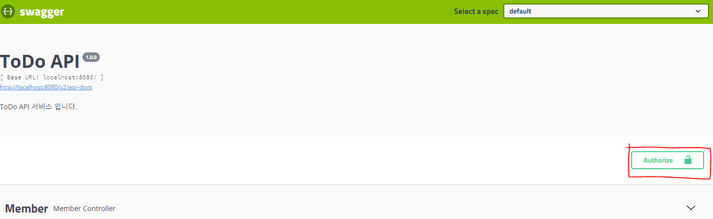
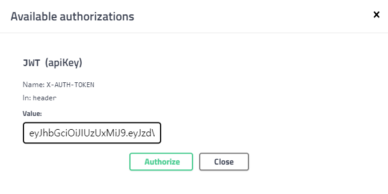
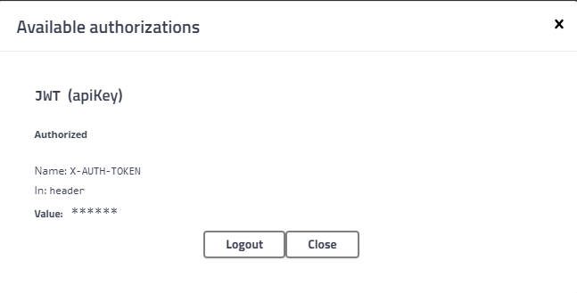

# Juwon TodoListAPI

## API 명세서

[API](https://www.notion.so/307a65c004d94daa97c8e5ea077f87ec)

노션 링크입니다!

### Todo Login

로그인을 해야 로그인 / 로그아웃 제외 모든 기능을 사용할 수 있습니다

jwt 전역처리를 진행해서 우측 상단의 인증 버튼을 가지고 로그인한 체로 테스트할 수 있습니다!

인증 버튼을 눌러서 토큰 입력할 수 있는 창을 띄웁니다

토큰에 로그인 후 나온 토큰을 입력해줍니다

로그아웃을 누르면 로그아웃이 됩니다

## 예정 개발 사항

- Response 값 제대로 나올 수 있게 하기

- 예외처리 및 유효성검사 구현하기

- ADMIN, USER 역할의 차이 구현하기 (전체 조회는 관리자만)

## 요구사항 반영 여부

요구사항을 알려주시면 여기에 표시하면서 반영 여부를 쓰겠습니다

